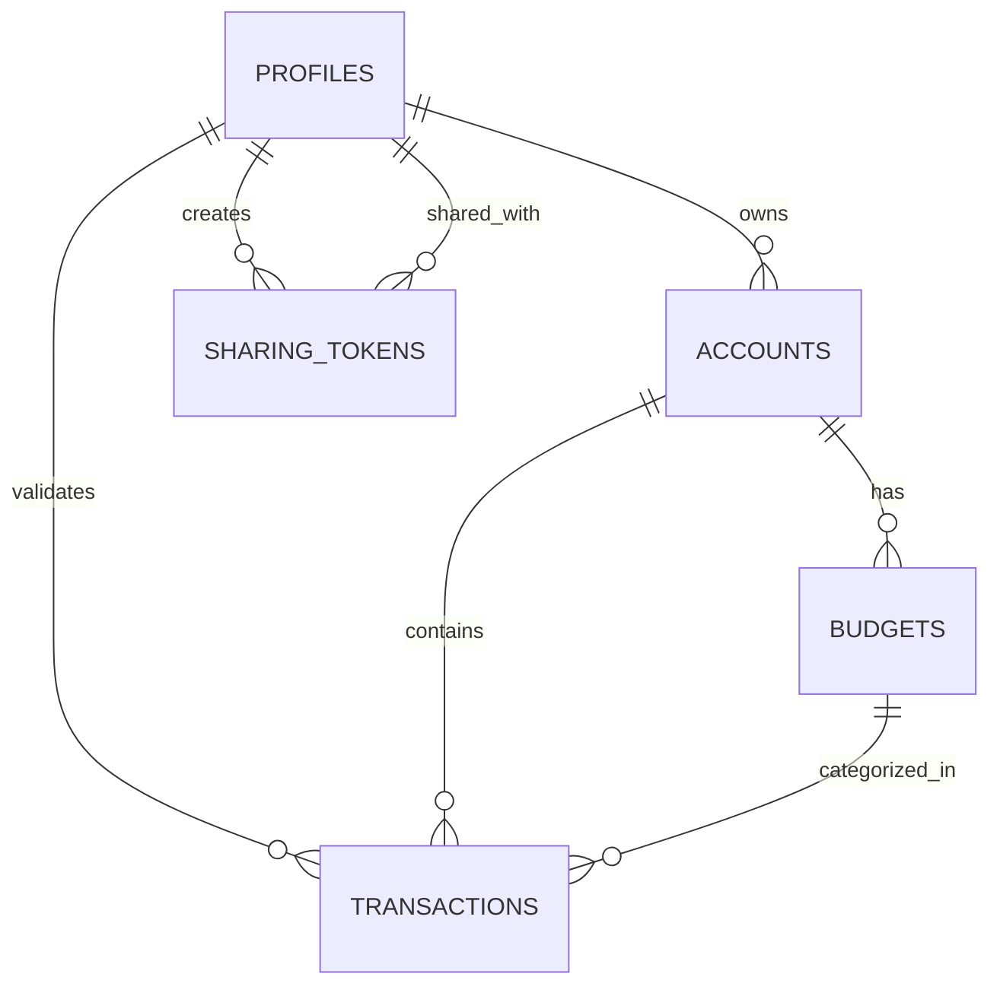

# Data Model - zenbudget

Ce document définit la structure des données et les règles de sécurité (RLS) pour **zenbudget**, en mettant l'accent sur la synchronisation "Dual-Pilot" et la vie privée.

## Schéma Relationnel (PostgreSQL)



### 1. Table `profiles`
Stocke les informations utilisateur et les préférences "Zen".
- `id`: uuid (PK, references auth.users)
- `email`: text
- `full_name`: text
- `avatar_url`: text
- `zen_mode_enabled`: boolean (default: true)
- `created_at`: timestamptz

### 2. Table `accounts` (Comptes Bancaires)
- `id`: uuid (PK)
- `owner_id`: uuid (FK -> profiles.id)
- `name`: text (ex: "Compte Courant")
- `balance`: decimal
- `currency`: text (default: "EUR")
- `is_shared`: boolean (Déclenche la logique Dual-Pilot)

### 3. Table `transactions` (Le cœur de l'Inbox)
- `id`: uuid (PK)
- `account_id`: uuid (FK -> accounts.id)
- `amount`: decimal
- `description`: text
- `category_id`: uuid (FK -> budgets.id, nullable)
- `status`: text (enum: 'pending', 'validated', 'ignored')
- `predicted_category`: text (IA suggestion)
- `validated_by`: uuid (FK -> profiles.id, nullable)
- `transaction_date`: timestamptz
- `created_at`: timestamptz

### 4. Table `budgets` (Catégories/Projets)
- `id`: uuid (PK)
- `owner_id`: uuid (FK -> profiles.id)
- `name`: text
- `icon`: text
- `monthly_limit`: decimal
- `is_savings_project`: boolean (Pour affichage ZenGauge)
- `target_amount`: decimal (Pour projets d'épargne)

### 5. Table `sharing_access` (Gestion du Duo/24h)
- `id`: uuid (PK)
- `owner_id`: uuid (FK -> profiles.id)
- `partner_id`: uuid (FK -> profiles.id)
- `token`: text (Unique)
- `expires_at`: timestamptz (Gère la fenêtre de 24h)
- `status`: text (enum: 'active', 'revoked', 'expired')

---

## Row Level Security (RLS) Policies

### Règle d'Or : Isolation par défaut
Chaque utilisateur ne voit que ses propres lignes, sauf si un jeton de partage actif existe.

**Exemple pour `transactions` :**
```sql
-- Johann peut voir ses propres transactions
CREATE POLICY "Users can view own transactions" 
ON transactions FOR SELECT 
USING (auth.uid() = (SELECT owner_id FROM accounts WHERE id = transactions.account_id));

-- Le partenaire peut voir les transactions si un accès 24h est actif
CREATE POLICY "Partners can view shared transactions" 
ON transactions FOR SELECT 
USING (
  EXISTS (
    SELECT 1 FROM sharing_access 
    WHERE partner_id = auth.uid() 
    AND owner_id = (SELECT owner_id FROM accounts WHERE id = transactions.account_id)
    AND expires_at > now()
    AND status = 'active'
  )
);
```

---

## Logique IA & Synchronisation

1. **Prédictions** : Une Edge Function écoute les nouvelles transactions (`INSERT`) et interroge l'IA pour remplir `predicted_category`.
2. **Realtime** : Le client frontend s'abonne aux changements sur `transactions` filtrés par `account_id`.
3. **Optimistic UI** : Lors du swipe, on passe le `status` à `validated` localement immédiatement.
