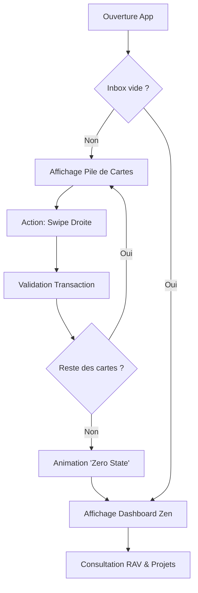
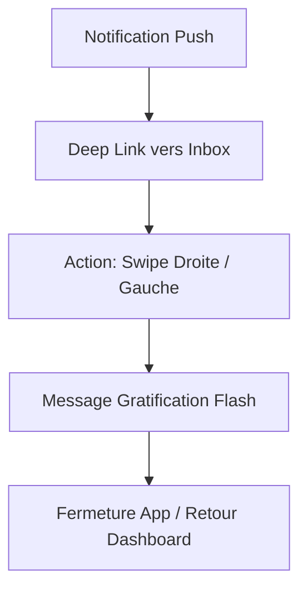
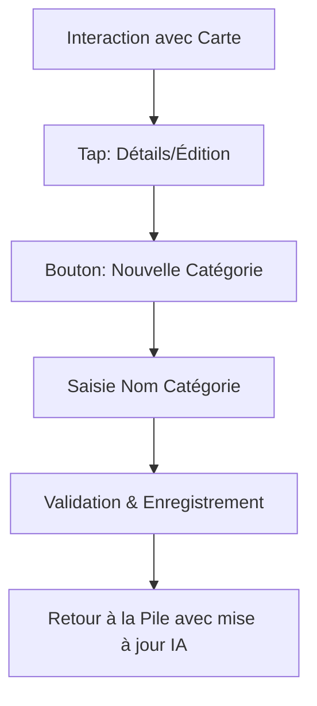

# UX Design Specification zenbudget

**Author:** Johann
**Date:** 2026-01-22

---

## Executive Summary

### Project Vision

Transformer la gestion financière familiale en un rituel **"Zen"** et gratifiant. L'application libère la charge mentale en remplaçant la saisie manuelle fastidieuse par un moteur prédictif et une interface de validation ludique de type **"Inbox Zero"**.

### Target Users

- **Le Pilote (Johann)** : Utilisateur investi, cherche à piloter précisément l'effort d'épargne commun et individuel.
- **Le Co-Pilote (Conjoint)** : Cherche une méthode sans effort pour contribuer au budget sans y passer plus de quelques secondes par jour.
- **Profil technique** : Utilisateurs à l'aise avec le web, privilégiant la rapidité et la clarté visuelle.

### Key Design Challenges

- **Vitesse vs Précision** : Garantir un flux "Swipe" ultra-rapide sans sacrifier la rigueur financière nécessaire à un outil de budget.
- **Coordination Familiale** : Gérer les interactions entre comptes et le partage de données (consentement 24h) sans interrompre l'expérience utilisateur.
- **Sérénité "Zen" en Mode Sombre** : Créer une atmosphère visuelle apaisante malgré la manipulation de chiffres potentiellement stressants.

### Design Opportunities

- **Micro-interactions Dopamine** : Utiliser des animations gratifiantes lors du "clash" des transactions validées pour transformer la tâche en jeu.
- **Visualisation Temporelle** : Transformer les soldes froids en jauges de progression dynamiques pour les projets "Rêve" (Vacances, Epargne).

## Core User Experience

### Defining Experience

L'expérience cœur réside dans le **"Rituel de l'Inbox Zero"**. L'utilisateur ne subit plus sa comptabilité ; il la pilote via une pile de transactions prédites qu'il vide d'un geste gratifiant. La sensation de contrôle immédiat est le moteur principal de l'engagement.

### Platform Strategy

- **Web App (SPA)** : Navigation fluide optimisée pour navigateurs desktop et mobiles.
- **Mobile First Interaction** : Priorité aux gestes tactiles (swipes) même sur navigateur mobile.
- **Zero-Refresh Synchronization** : Mise à jour en temps réel des données pour une coordination instantanée avec le conjoint.

### Effortless Interactions

- **Prédiction de Routine** : L'IA identifie les récurrences pour que l'utilisateur n'ait qu'à confirmer, jamais à saisir manuellement.
- **Accès Rapide (24h)** : Validation de partage simplifiée sur le Dashboard pour une consultation flash sans friction d'authentification lourde répétée.
- **Classification Automatique** : Apprentissage des catégories à partir des corrections utilisateur.

### Critical Success Moments

- **"Inbox Vicieuse" Vidée** : Le moment où l'utilisateur voit l'écran "Félicitations, vous êtes à jour !" après avoir traité ses dépenses.
- **Objectif Atteint** : Visualisation de l'impact direct d'une économie réalisée sur la jauge d'un projet "Rêve".
- **Validation Conjointe** : Voir instantanément que le conjoint a lui aussi complété son rituel.

### Experience Principles

- **Vitesse Maximale** : Chaque seconde épargnée sur la saisie est une seconde de "Zen" gagnée.
- **Feedback Ludique** : Micro-animations gratifiantes pour chaque action de validation.
- **Atmosphère Apaisante** : Mode sombre, contrastes doux et espacements généreux pour réduire le stress financier.
- **Clarté Décisionnelle** : Prioriser le "Reste à Vivre" sur les listes de transactions brutes.

## Desired Emotional Response

### Primary Emotional Goals

- **Calme & Maîtrise** : L'utilisateur doit se sentir apaisé en manipulant ses finances. L'interface évite toute alerte anxiogène (rouge vif, alarmes).
- **Accomplissement** : La satisfaction psychologique de vider une pile de tâches (Inbox Zero) transforme la contrainte en succès.
- **Confiance** : La certitude que les prédictions de l'IA sont fiables et que les données sont exactes.

### Emotional Journey Mapping

- **À l'ouverture** : **Clarté**. "Je sais exactement où j'en suis à l'instant T."
- **Pendant l'action (Swipe)** : **Fluidité & Jeu**. "C'est facile, rapide, et presque amusant."
- **À la fermeture** : **Sérénité**. "Je suis à jour, mon avenir financier est sous contrôle, je peux me détendre."

### Micro-Emotions

- **Satisfaction** : Le sentiment de propreté visuelle quand l'Inbox est vide.
- **Soulagement** : La disparition d'une dépense "stressante" une fois qu'elle est classée et budgétisée.
- **Connexion** : Se sentir soutenu par l'outil et par le conjoint dans l'effort commun.

### Design Implications

- **Sérénité** → Palette de couleurs sombres et profondes, typographies aérées, absence d'éléments visuels agressifs.
- **Gratification** → Micro-animations de type "poussière d'étoiles" ou transition de fondu organique lors de la validation d'une transaction.
- **Transparence** → Accès discret mais permanent à l'historique des modifications par le conjoint pour prévenir les surprises.

### Emotional Design Principles

- **Zen by Design** : L'esthétique prime sur la densité d'information. On ne montre que ce qui est nécessaire pour l'émotion de calme.
- **Speed is Serene** : Moins on passe de temps sur la tâche, plus l'esprit est libéré.
- **Rewarding Discipline** : La régularité (rituel de 10s) est récompensée par des visuels gratifiants.

## UX Pattern Analysis & Inspiration

### Inspiring Products Analysis

- **Superhuman (Email)** : Référence absolue pour la gestion de flux ("Inbox Zero"). On s'inspire de leur obsession pour la vitesse de traitement et l'absence totale de friction entre l'intention et l'action.
- **Simple (Fintech)** : Pionnier de la clarté financière. On adopte leur philosophie du "Safe-to-Spend" (notre RAV) qui prime sur le solde brut.
- **Apple Health/Fitness** : Pour la gamification douce des objectifs quotidiens via des jauges circulaires épurées.

### Transferable UX Patterns

- **Pile de Cartes Dynamique** : Pattern de traitement séquentiel pour l'Inbox Zero, permettant de se concentrer sur une seule transaction à la fois.
- **Jauge de Progression Circulaire** : Pour visualiser l'effort d'épargne et le Reste à Vivre de manière organique.
- **Micro-gestes (Swipes)** : Navigation gestuelle sur mobile et interactions rapides sur desktop pour "vider" l'inbox.

### Anti-Patterns to Avoid

- **Dashboard "Tableau de Bord Avion"** : Éviter la profusion de petits chiffres et de graphiques complexes qui créent de l'anxiété.
- **Multi-clics pour validation** : Éviter les formulaires de confirmation ou les modales interrompant le flux de swipe.
- **Alertes Rouges** : Éviter le rouge pour les dépenses (sauf erreur système), privilégier des tons neutres ou sombres pour rester dans le "Zen".

### Design Inspiration Strategy

- **Adopter** : Le concept de "Vitesse comme Fonctionnalité" (Superhuman) et le "RAV Prioritaire" (Simple).
- **Adapter** : Les jauges de progression pour les lier à des projets de vie concrets (Vacances, Epargne).
- **Éviter** : La complexité visuelle des outils de comptabilité traditionnels (type Splitwise ou Excel).

## Design System Foundation

### Design System Choice

**Shadcn/UI (basé sur Radix UI & Tailwind CSS)**.

### Rationale for Selection

- **Équilibre Vitesse/Unicité** : Permet de ne pas réinventer les boutons et menus tout en gardant une liberté totale sur le style visuel final.
- **Accessibilité & Robustesse** : Radix UI gère parfaitement l'accessibilité native, crucial pour un outil premium.
- **Écosystème Tailwind** : Facilite la réactivité et le design mobile-first exigé pour les interactions de type "swipe".
- **Dark Mode Natif** : Intégration fluide et élégante, indispensable pour l'ambiance "Zen".

### Implementation Approach

Nous utiliserons les composants Shadcn/UI pour la structure de base (Layout, Navigation, Inputs) tout en encapsulant les interactions cœur dans des composants custom.

### Customization Strategy

- **Cœur Custom** : Développement d'un composant "Stack de Cartes" sur mesure pour l'Inbox Zero (vitesse <100ms).
- **Dataviz Organique** : Utilisation de SVG ou de librairies légères pour les jauges circulaires de RAV et d'objectifs, stylisées pour le mode sombre.
- **Micro-interactions** : Utilisation de Framer Motion pour les transitions fluides et gratifiantes.

## 2. Core User Experience

### 2.1 Defining Experience

L'expérience déterminante de **zenbudget** est le **"Swipe to Zen"**. C'est le rituel où l'utilisateur transforme une pile de transactions inconnues en un budget maîtrisé via un geste fluide et gratifiant, libérant instantanément sa charge mentale.

### 2.2 User Mental Model

- **Passé** : "La comptabilité est une corvée de saisie de chiffres dans un tableau." (Modèle Passif/Stressant).
- **zenbudget** : "Je suis le pilote d'un flux de suggestions intelligentes." (Modèle Actif/Serein). L'utilisateur s'attend à ce que l'outil ait déjà fait 90% du travail (prédiction) et qu'il ne reste que la validation finale.

### 2.3 Success Criteria

- **Vitesse Éclair** : Traitement de 10 transactions en moins de 15 secondes.
- **Récompense Psychologique** : Sentiment physique de "nettoyage" et de clarté à la fin du rituel.
- **Zéro Friction** : Aucun blocage sur une transaction inconnue (fallback simple vers "ignorer" ou "plus tard").

### 2.4 Novel UX Patterns

- **Inbox Zero Budgétaire** : Adaptation du pattern d'email à la finance.
- **Pile de Cartes "Zen"** : Utilisation d'un espace visuel minimaliste focalisé sur une seule décision à la fois pour éviter la surcharge cognitive.

### 2.5 Experience Mechanics

1. **Initiation** : Un indicateur visuel discret ("x transactions à valider") invite au rituel sans agression.
2. **Interaction** :
    - **Swipe Droite** : Valider la prédiction.
    - **Swipe Gauche** : Ignorer / Supprimer la suggestion.
    - **Tap** : Ouvrir les détails pour correction rapide.
3. **Feedback** : Micro-vibration tactile et animation de sortie de carte fluide vers le haut (élan positif).
4. **Complétion** : Affichage d'un "Zero State" gratifiant (visuel apaisant et mise à jour du RAV) confirmant le succès de la session.

## Visual Design Foundation

### Color System

**Thème : Ocean Calm**
- **Fond (Background)** : `#0f172a` (Marine abyssal profond).
- **Cartes & Surfaces** : `#1e293b` avec effet de flou (Glassmorphism).
- **Accents (Primary)** : `#06b6d4` (Cyan translucide) pour les jauges et les boutons d'action.
- **Texte** : `#f8fafc` (Blanc cassé) pour un contraste doux.
- **Success** : `#10b981` (Émeraude) pour les validations.

### Typography System

- **Police de base** : **Inter** (ou System Sans) - Choisi pour sa clarté géométrique et sa lisibilité parfaite sur les chiffres.
- **Police de Titrage/Accent** : **Outfit** - Pour une touche de modernité premium et de douceur.
- **Hiérarchie** : Focalisation sur les chiffres (RAV) en taille `text-4xl` ou `text-5xl` avec un poids font-semibold.

### Spacing & Layout Foundation

- **Layout "Spacious"** : Utilisation généreuse de `padding` et `gap` (base 8px) pour éviter toute sensation de surcharge.
- **Interaction Mobile** : Zones de toucher minimales de 48x48px pour les cartes de l'Inbox.
- **Grid** : Système flexible à 12 colonnes sur desktop, passage en colonne unique centrée sur mobile pour focaliser l'attention sur l'Inbox.

### Accessibility Considerations

- **Contraste** : Vérification stricte des ratios (WCAG AA) entre le cyan et le marine profond.
- **Feedback Haptique** : Recommandé pour les interactions de swipe sur mobile pour confirmer l'action sans regarder l'écran.
- **Mode Sombre Natif** : L'interface est conçue exclusivement pour le mode sombre, réduisant la fatigue oculaire lors du rituel du soir.

## Design Direction Decision

### Design Directions Explored

- **Direction 1 : Le Pilote Holistique** (Dashboard-First).
- **Direction 2 : Le Rituel Quotidien** (Inbox-First).

### Chosen Direction

**Direction 2 : Le Rituel Quotidien (Inbox-First)**

L'application s'ouvre directement sur la pile de transactions à valider. Le Dashboard et les projets d'épargne deviennent des vues secondaires accessibles une fois l'Inbox vidée ou via une navigation gestuelle.

### Design Rationale

- **Alignement "Inbox Zero"** : Cette direction place l'action cœur (le swipe) au centre de l'expérience, garantissant le respect du contrat des "10 secondes quotidiennes".
- **Réduction du Bruit** : En minimisant la vue dashboard initiale, on réduit la surcharge cognitive et l'anxiété potentielle liée aux chiffres globaux avant d'avoir traité les transactions du jour.
- **Efficacité Mobile** : Idéal pour un usage rapide "on-the-go" ou le soir au lit.

### Implementation Approach

- **Home Screen** : Une pile de cartes plein écran (ou prédominante).
- **Navigation Flow** : Une fois la pile vidée, une transition fluide révèle le Dashboard ("Zero State").
- **Visual Weight** : Focus sur la carte active, arrière-plan Ocean Calm flouté pour la profondeur.

## User Journey Flows

### 3.1 Le Rituel du Soir (Pilote - Johann)

Ce flux est optimisé pour la clôture de la journée, apportant un sentiment de contrôle final avant le repos.

### 3.2 La Validation Flash (Co-Pilote)

Flux ultra-court déclenché par une notification, visant une friction minimale.

### 3.3 Création Agile de Catégorie

Permet d'adapter l'outil à la vie réelle sans interrompre le flux de validation.

### Journey Patterns

- **Pattern de Pile (Stack)** : Une seule information à la fois pour éviter la surcharge.
- **Micro-Gratification** : Feedback visuel immédiat après CHAQUE swipe.
- **Accès Direct** : L'app se souvient de l'état de l'Inbox pour gagner du temps.

### Flow Optimization Principles

- **Effort minimal** : L'accès à l'action principale (validation) est à moins de 1 seconde de l'ouverture.
- **Transition fluide** : Le Dashboard n'est pas vu comme un "autre écran" mais comme la récompense de l'effort de validation.

## Component Strategy

### Design System Components (Shadcn/UI)

Nous utiliserons les composants de base pour la structure et les utilitaires :
- **Buttons / Badge** : Pour les actions secondaires et les étiquettes de catégories.
- **Dialog / Sheet** : Pour la création de catégories ou l'édition de transactions.
- **Card** : Comme base structurelle pour tous les éléments d'interface.
- **Sans-serif Typography** : Via le système de design Tokens de Tailwind.

### Custom Components

#### 1. TransactionStack (The Core)
- **Purpose** : Gérer la pile de transactions "Inbox Zero".
- **Interaction** : Supporte les gestes de swipe (flick) avec retour visuel dynamique (inclinaison, opacité).
- **States** : Empty (Zero State), Loading, Error, Swiping.
- **Accessibility** : Navigation au clavier (flèches gauche/droite) pour les utilisateurs desktop.

#### 2. ZenGauge (Circular Dataviz)
- **Purpose** : Afficher le Reste à Vivre (RAV) ou la progression d'un projet d'épargne.
- **Anatomy** : Cercle incomplet (arc), valeur centrale, label descriptif, aura lumineuse cyan.
- **Variants** : Large (Dashboard central), Small (Cards de projets).

#### 3. CategoryItem
- **Purpose** : Afficher un flux budgétaire spécifique.
- **Content** : Nom, Icône, Montant dépensé, Barre de progression linéaire (mini-version).
- **Behavior** : Tap pour ouvrir les détails historiques.

### Component Implementation Strategy

- **Base** : Utilisation des primitives Radix UI via Shadcn/UI pour garantir l'accessibilité.
- **Styling** : Tailwind CSS pour le thème Ocean Calm et le mode sombre natif.
- **Animation** : **Framer Motion** est requis pour la fluidité organique de la `TransactionStack` et les transitions de "Zero State".

### Implementation Roadmap

- **Phase 1 (MVP)** : `TransactionStack` et `ZenGauge` (Dashboard principal).
- **Phase 2** : `CategoryItem` et composants de gestion (Modales de création).
- **Phase 3** : Composants d'analyse avancée (Mini-charts temporels).

## UX Consistency Patterns

### Button Hierarchy

- **Action Primaire** : Boutons pleins (Cyan `#06b6d4`). Utilisés pour la validation finale ou l'enregistrement de paramètres.
- **Action Secondaire** : Boutons "Ghost" ou Outline avec effet de flou. Utilisés pour "Ignorer" ou "Paramètres".
- **Action Prioritaire (Inbox)** : Le geste (Swipe) prévaut sur le bouton. L'UI doit guider vers le geste plutôt que vers le clic.

### Feedback Patterns

- **Succès (Validation)** : Sillage émeraude fluide (Framer Motion) et disparition de la carte vers le haut.
- **Avertissement (Budget)** : Utilisation de tons orangés doux ("Sunset"). Message proactif : *"Cet objectif demande un ajustement."*
- **Chargement** : Effet de "Shimmer" organique traversant la pile de cartes, évitant les spinners rotatifs classiques.

### Empty States (Zen State)

Quand l'Inbox est vide :
- **Visuel** : Illustration minimaliste d'une onde sur l'eau ou d'un ciel étoilé calme.
- **Message** : *"Tout est calme. Vous êtes à jour."*
- **Action** : Lien discret vers le Dashboard complet.

### Navigation Patterns

- **Mobile** : Barre de navigation basse (Tab Bar) réduite au strict minimum (Inbox, Dashboard, Profil).
- **Gestuelle** : Swipe latéral pour basculer entre l'Inbox active et le Dashboard de synthèse.
